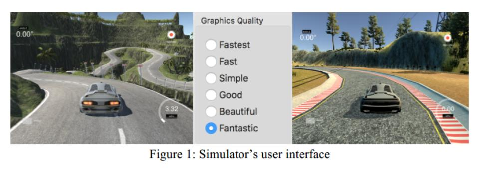
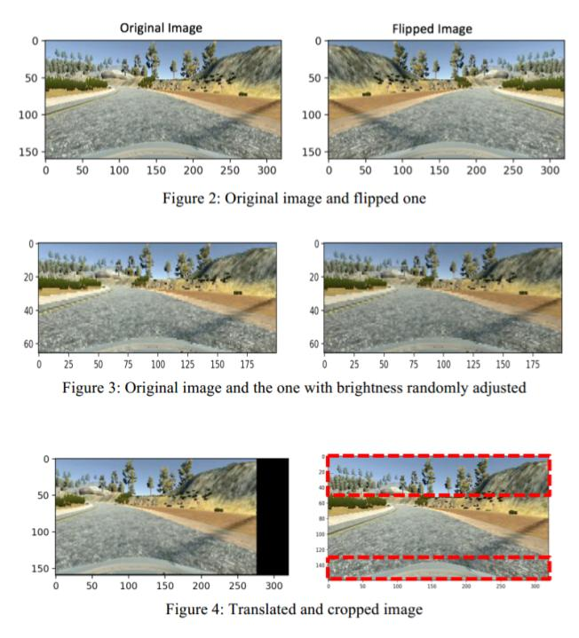
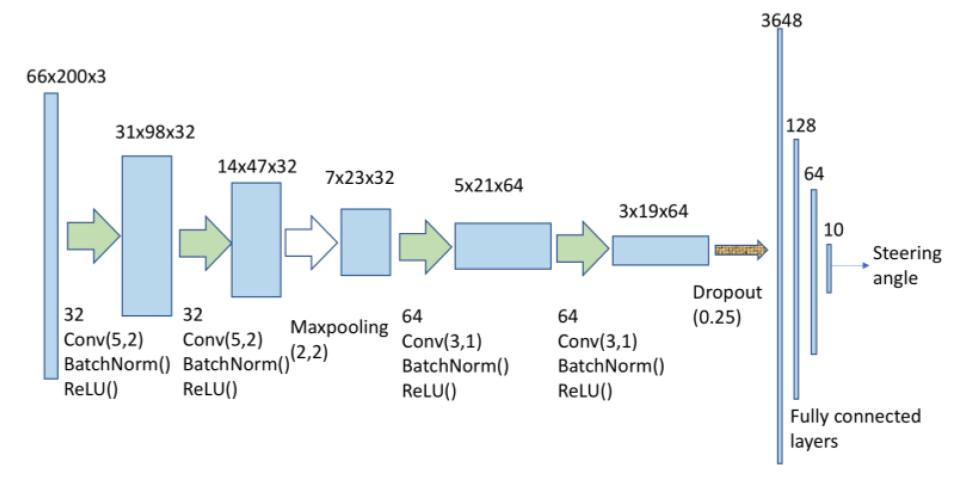

# CSE525_Final_Project

The aim of this project is to implement a pipeline for training and simulating autonomous car in 3D
simulation environment using CNN including collecting training/test data, designing a CNN network to
train and run autonomous car in the simulation environment which is a Unity based game platform
provided by Udacity: [https://github.com/udacity/self-driving-car-sim](https://github.com/udacity/self-driving-car-sim)

# Data preparation
1. Follow instructions in section "Data Collection" to collect training data or download the data [here](https://drive.google.com/file/d/1O9hiYPS-d9WFt6DgulCkl22xK5JnCa6p/view?usp=sharing)
2. Put all training folders inside folder 'data'
3. Modify the settings of variable "dirs" in file main.py to contain your training folders.

# Training Model:
From terminal, run: python train.py

# Test Model 
From terminal, run: python drive.py ${trained_model_name}

# Dependencies
 - [Pytorch 0.4.0](http://pytorch.org/)
 - Numpy
 - [OpenCV-Python](https://pypi.python.org/pypi/opencv-python)

# Data collection
If you wish to collect more data or different data, it must be collected manually by driving the car (playing the game) along the
road. During playing, the simulator will capture 3 views representing left, center, and right cameras as
well as the steering angle and the car’s velocity. Those 3 views are saved as .jpg images and numerical
data is saved to a .csv file along with the file names of corresponding images of the scene. 

## Data Augmentation
As a normal practice in training a convolutional neural network, data augmentation is often used to
improve the learning ability of the model and to compensate the lack of training data. In this project,
several common augmentation techniques are used such as random flip, random translation, brightness
adjustment, and crop un-useful areas.

# Model implementation
A simple CNN model including two Convolutional layers, 2 MaxPooling, and 4 fully connected layers is
used first to optimize the data augmentation techniques and to choose appropriate optimizer and hyperparameters for the problem. The simple model quickly works well for when sufficient data augmentation included but it only works for a certain number of testing cases. As a result, a more complex model is required.

# Training
During training phase, the input images which are the view from left, center, or right camera are fed to the
CNN after going through augmentation module. The steering angles collected during data collection are
used as supervised labels to optimize the model. Mean squared error is used as the loss function since the
output and label are scalars

# Conclusion
In this project, a pipeline for training and simulating autonomous car in 3D simulation environment using
CNN is implemented and analyzed. It has shown that the CNN model is capable of learning useful visual
feature not only in a same distribution (same road type) but also in different data distribution (different
road views). As the result, it is able to successfully generate appropriate control signals to drive the car in
different environment settings.
